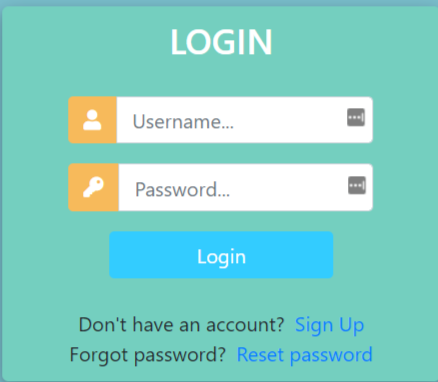
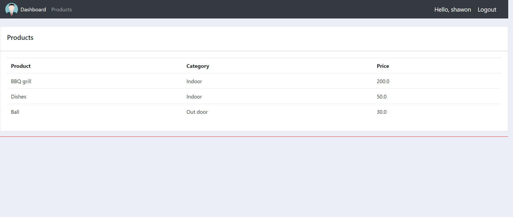

# Django-CustomerOrderMng.
Login page: 

Register page: 

Home page:

Ordering page:

Customer page:

Total products and cost page: 

How to run:  
Make sure django is installed properly.  
Step 1: Run python virtual environment.  
Step 2: Goto folder (crm1) where manage.py exists  
step 3: run the command on windows 'py manage.py runserver'  
Step 4: Goto the given server link such as http://127.0.0.1:8000/  
